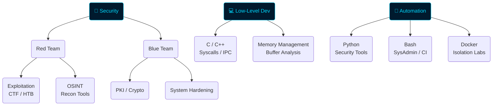

<div align="center">


<br/>

[](https://42.fr)
[](https://hackthebox.com)
[](https://kali.org)
[](https://ctftime.org)

</div>

---

## `$ whoami`


```zsh
╔══════════════════════════════════════╗
║  ~/Cornedru/.profile                 ║
╠══════════════════════════════════════╣
║  👤  Cornedru                        ║
║  🎓  École 42 — Cybersecurity        ║
║  🔐  Red Team  |  Pentest  |  OSINT  ║
║  💻  C  |  C++  |  Python  |  Bash   ║
║  🛡️  CTFs  |  HTB  |  Rev. Eng.     ║
║  🌍  Based in France                 ║
╚══════════════════════════════════════╝
```

**Security-minded system developer** studying at **École 42**. I live at the intersection of offensive security and low-level programming — building tools that crack things open, understanding why they break, then hardening them properly.

> *"I break systems to build better ones."*

<br clear="right"/>

---

## `$ cat /etc/arsenal`

<div align="center">

### Languages & Runtime


### Tools & Platforms


### Security Stack
<br/>


</div>

---

## `$ ls -la ~/projects/`

<div align="center">

| Project | Description | Stack |
|:--------|:------------|:------|
| 🐚 [**Minishell**](https://github.com/Cornedru/Minishell) | Unix shell — pipes, redirections, builtins from scratch | `C` |
| 🎮 [**Cube_3D**](https://github.com/Cornedru/Cube_3D) | Raycasting 3D engine à la Wolfenstein | `C` `MLX` |
| 🧵 [**Philosophers**](https://github.com/Cornedru/Philo) | Dining philosophers — multithreading & mutex | `C` `pthread` |
| 📚 [**Libft**](https://github.com/Cornedru/Libft) | Full libc reimplementation from zero | `C` |
| 🔒 [**AppLock**](https://github.com/Cornedru/AppLock) | Application security locking mechanism | `C` `Python` |
| 🚩 [**CTF**](https://github.com/Cornedru/CTF) | CTF writeups & exploitation scripts | `Python` `Bash` |
| 🔍 [**Autoscope**](https://github.com/Cornedru/Autoscope) | Automated recon & OSINT framework | `Python` `Bash` |

</div>

---

## `$ nmap --script security-profile`

<table>
<tr>
<td width="50%" valign="top">

### 🔴 Offensive

```
⚔️  Penetration Testing
│
├── 🌐 Network Recon
│     ├─ Nmap / Masscan
│     ├─ Passive fingerprinting
│     └─ Service enumeration
│
├── 💥 Exploitation
│     ├─ Buffer overflows
│     ├─ Format string attacks
│     ├─ Use-after-free
│     └─ Web vuln (SQLi, XSS, SSRF)
│
├── 🎯 CTF & RE
│     ├─ Binary exploitation
│     ├─ Ghidra / GDB / pwndbg
│     └─ Crypto challenges
│
└── 🔍 OSINT
      ├─ Automated data harvesting
      └─ Footprinting tooling
```

</td>
<td width="50%" valign="top">

### 🟢 Defensive

```
🛡️  Security Engineering
│
├── 🔐 PKI & Cryptography
│     ├─ Cert management
│     ├─ SSL/TLS implementation
│     └─ Key generation & storage
│
├── ✅ Secure Coding
│     ├─ Input validation (C/C++)
│     ├─ Memory-safe patterns
│     └─ Code review
│
├── 🏗️ System Hardening
│     ├─ Network segmentation
│     ├─ Firewall / IDS setup
│     └─ Docker isolation
│
└── 🧠 Threat Modeling
      ├─ Zero-trust design
      └─ Security by architecture
```

</td>
</tr>
</table>

<details>
<summary>🗺️ <b>Dev Stack — dependency graph</b></summary>
<br>



</details>

---

## `$ git log --oneline --graph`

<div align="center">


</div>

---

## `$ cat /etc/objectives`

<div align="center">

```diff
  ROADMAP 2025-2026
  ═══════════════════════════════════════════
+ [✅] École 42 Cybersecurity curriculum
+ [🔄] OSCP Certification — in progress
+ [🎯] Build & release custom pentest framework
+ [🔥] Contribute to Metasploit / Burp extensions
+ [📖] CTF writeups — documenting every solve
+ [🎓] Red Team internship
  ═══════════════════════════════════════════
```

</div>

---

## `$ who -a # Achievements`

<div align="center">


<br/><br/>

| 🎖️ | Status | Link |
|:---|:-------|:-----|
| 🎓 **École 42** — Cybersecurity & System Dev | Active · 2024→ | [42.fr](https://42.fr) |
| 🏴‍☠️ **HackTheBox** — Active Member | Pwning boxes | [HTB Profile](https://hackthebox.com) |
| 🚩 **CTF Time** — Competitor | Ongoing | [CTFtime](https://ctftime.org) |

</div>

---

## `$ curl -s contact.cornedru.dev`

<div align="center">

[](mailto:ryry24@gmx.fr)
[](https://github.com/Cornedru)
[](https://linkedin.com)
[](https://twitter.com/cornedru)
[](https://hackthebox.com)

<br/>


</div>

---

<div align="center">


<sub>🔒 École 42 · 🛡️ Aspiring Red Team Operator · 💻 Open to cybersecurity internships · Built with ☕ & obsession</sub>

</div>
