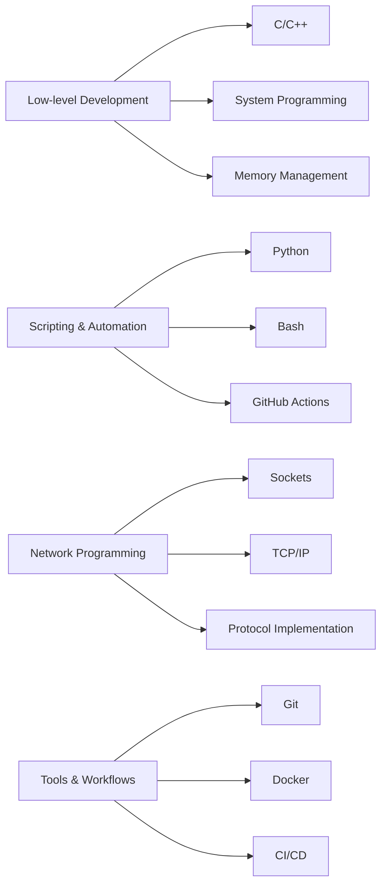

# Hey, I'm Nail Dehmej 👋
> Cybersecurity enthusiast · Low-level developer · Automation architect — crafting secure, elegant chaos.

<p align="center">
  
</p>

<p align="center">
  
  
  
</p>

---

## 👁️‍🗨️ About Me


**Security-minded system developer** studying at **École 42 Mulhouse**, focused on offensive security, low-level programming, and automation. I build tools that break things *elegantly* — then secure them properly.

```bash
$ cat /home/nail/.about
━━━━━━━━━━━━━━━━━━━━━━━━━━━━━━━━━━
👤 Nail Dehmej | @Cornedru
━━━━━━━━━━━━━━━━━━━━━━━━━━━━━━━━━━
🎓 École 42 · Cybersecurity & System Development
🔐 Red Team | Pentesting | PKI | OSINT
💻 C | C++ | Python | Bash
🛡️ CTFs | Hack The Box | Reverse Engineering
🤖 GitHub Actions | CI/CD | Automation
━━━━━━━━━━━━━━━━━━━━━━━━━━━━━━━━━━
```

<br clear="right"/>

---

## 🔧 Tech Arsenal

<p align="center">
  
</p>

<p align="center">
  
  
  
  
</p>

---

## 📊 GitHub Analytics

<p align="center">
  
  
</p>

<p align="center">
  
</p>

<p align="center">
  
</p>

---

## 🚀 Featured Projects

<div align="center">

| 🐚 **Minishell** | 🎮 **Cub3D** | 🧵 **Philosophers** |
|:---:|:---:|:---:|
| [](https://github.com/Cornedru/Minishell) | [](https://github.com/Cornedru/Cube_3D) | [](https://github.com/Cornedru/Philo) |
| Unix shell with pipes & redirections | Raycasting 3D engine | Multi-threading dining philosophers |

| 📚 **Libft** | 🧊 **Mini-Chill** | 🚩 **CTF** |
|:---:|:---:|:---:|
| [](https://github.com/Cornedru/Libft) | [](https://github.com/Cornedru/Mini-Chill) | [](https://github.com/Cornedru/CTF) |
| Custom C library from scratch | Network programming project | CTF challenges & writeups |

</div>

---

## 🛡️ Security & Development Focus

<table>
<tr>
<td width="50%">

### 🔴 Offensive Security
```yaml
⚔️  Penetration Testing
    ├─ Network reconnaissance
    ├─ WiFi security auditing
    └─ Linux privilege escalation

🎯  CTF & Exploitation
    ├─ Binary exploitation
    ├─ Web vulnerabilities
    └─ Cryptography challenges

🧠  Memory Analysis
    ├─ Buffer overflows
    ├─ Use-after-free
    └─ Format string attacks

🔍  OSINT Automation
    ├─ Data harvesting scripts
    ├─ Social engineering
    └─ Footprinting tools
```

</td>
<td width="50%">

### 🟢 Defensive Security
```yaml
🔐  PKI & Cryptography
    ├─ Certificate management
    ├─ SSL/TLS implementation
    └─ Key generation & storage

✅  Secure Coding
    ├─ Input validation
    ├─ Memory safety (C/C++)
    └─ Code review practices

🛡️  System Hardening
    ├─ Network segmentation
    ├─ Firewall configuration
    └─ Intrusion detection

🏗️  Architecture Security
    ├─ Threat modeling
    ├─ Security by design
    └─ Zero-trust principles
```

</td>
</tr>
</table>

<details>
<summary>💻 <b>Development Stack</b> (click to expand)</summary>
<br>



**Languages & Technologies:**
- ⚡ **C/C++** - System programming, memory management, performance optimization
- 🐍 **Python** - Automation, scripting, security tools development
- 📜 **Bash** - Shell scripting, system administration, automation
- 🌐 **Network Programming** - Sockets, TCP/IP, protocol implementation
- ⚙️ **System Programming** - Syscalls, processes, inter-process communication
- 🔧 **DevOps Tools** - Git, Docker, GitHub Actions, CI/CD pipelines

</details>

---

## 🎯 Current Objectives

<p align="center">
  
</p>

```diff
+ ✅ Complete École 42 Cybersecurity curriculum
+ 🎯 Achieve OSCP certification
+ 🔥 Contribute to major security tools (Metasploit, Burp extensions)
+ 💡 Build and open-source custom pentesting frameworks
+ 📖 Write technical security blog posts and CTF writeups
+ 🎓 Land cybersecurity internship in Red Team operations
```

---

## 🏆 Achievements & Certifications

<p align="center">
  
</p>

<div align="center">

| 🎖️ Achievement | 📅 Date | 🔗 Link |
|:---:|:---:|:---:|
| 🎓 **École 42 Student** | 2024 - Present | [École 42](https://42.fr) |
| 🏴‍☠️ **HackTheBox Member** | 2024 - Present | [Profile](https://hackthebox.com) |
| 🚩 **CTF Participant** | Ongoing | [CTF Time](https://ctftime.org) |

</div>

---

## 📫 Connect & Collaborate

<p align="center">
  <a href="mailto:Naildehmej68@gmail.com">
    
  </a>
  <a href="https://github.com/Cornedru">
    
  </a>
  <a href="https://linkedin.com/in/nail-dehmej">
    
  </a>
  <a href="https://twitter.com/cornedru">
    
  </a>
</p>

<p align="center">
  
</p>

---

## 💭 Quote of the Day

<p align="center">
  
</p>

---

## 📈 Contribution Graph

<p align="center">
  
</p>

---

<p align="center">
  
  
  
</p>

<p align="center">
  <sub>🔒 Studying at École 42 | 🛡️ Aspiring Red Team Operator | 💻 Open to cybersecurity internships</sub>
</p>

<p align="center">
  <sub>Last updated: 2025 | Built with 💙 and ☕ | Powered by curiosity and caffeine</sub>
</p>
