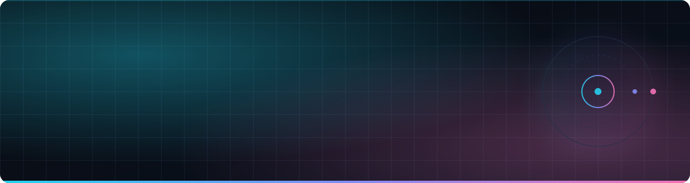
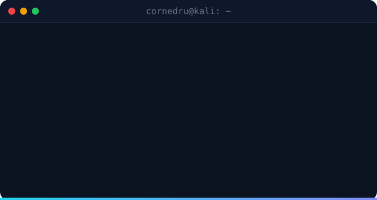
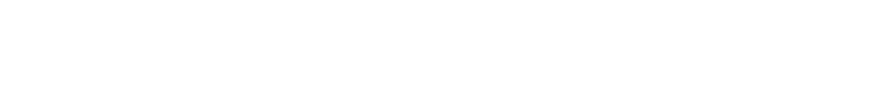

<div align="center">



<br/><br/>

<a href="https://42.fr"></a>&nbsp;<a href="https://hackthebox.com"></a>&nbsp;&nbsp;

<br/><br/>

&nbsp;

</div>

<br/>

<table align="center" border="0">
<tr>
<td width="55%" valign="middle">

</td>
<td width="45%" valign="middle">

### Hey, I'm Cornedru

**Reverse engineer** and **bug bounty hunter**, trained at **École 42**.

My thing is taking apart the protections that sit between a browser and a server: obfuscated JavaScript, custom virtual machines, fingerprinting and anti-bot layers. I rebuild the logic in **Rust** or **Go**, then report what breaks.

- 🔬 Reverse engineering of client-side protections (CAPTCHA & anti-bot services, among others)
- 🐛 Bug bounty on large-scale web services
- 🦀 Rust for the heavy lifting, Go for network tooling, C from 42
- 🧪 HackTheBox & CTFs on the side
- 💼 Open to **security / reverse engineering** roles

> *Peel the obfuscation, reimplement the logic, file the report.*

</td>
</tr>
</table>

<br/>


## ⚡ Stack

<table align="center" border="0">
<tr>
<td align="center" width="33%">
<b>Languages</b><br/><br/>
<br/>

</td>
<td align="center" width="33%">
<b>Environment</b><br/><br/>

</td>
<td align="center" width="33%">
<b>Reverse & Security</b><br/><br/>


<br/>


</td>
</tr>
</table>

<br/>


## 🧭 What I work on

<table align="center" border="0">
<tr>
<td width="33%" valign="top">

### 🔬 Reverse engineering
**Client-side protections** · obfuscated JS, custom bytecode VMs, challenge-response flows<br/>
**Fingerprinting** · browser & TLS fingerprints, sensor data, device signals<br/>
**Native** · ELF analysis, Ghidra, GDB, protocol reconstruction

</td>
<td width="33%" valign="top">

### 🐛 Bug bounty
**Targets** · CAPTCHA & anti-bot services, large web platforms<br/>
**Infra** · origin exposure behind CDN / WAF, misconfigurations<br/>
**Process** · PoC, impact write-up, responsible disclosure

</td>
<td width="33%" valign="top">

### 🦀 Systems & tooling
**Rust** · async production services, multi-crate workspaces, protocol reimplementation<br/>
**Go** · HTTP stacks, browser-like transport, scrapers<br/>
**C** · 42 curriculum: shells, threads, raycasting, libc from scratch

</td>
</tr>
</table>

<br/>


## 📈 Activity



<br/>

<div align="center">


<br/>


<sub>Most of my work lives in private repositories: the public graph is only the tip of it.</sub>

</div>

<br/>


## 🗺️ Roadmap

```diff
  2026 → 2027
+ [done]  École 42 core curriculum
+ [done]  First bug bounty reports on anti-bot / CAPTCHA services
! [wip]   Deeper reverse engineering of browser-side VMs & fingerprinting
! [wip]   Rust tooling for protocol & protection analysis
- [next]  Public write-ups (HTB, reverse engineering notes)
- [next]  Full-time security / reverse engineering position
```

<br/>


## 📬 Contact

<div align="center">

<a href="mailto:ryry24@gmx.fr"></a>&nbsp;<a href="https://github.com/Cornedru"></a>&nbsp;<a href="https://linkedin.com"></a>&nbsp;<a href="https://twitter.com/cornedru"></a>

<br/><br/>

<sub>Stay curious. Break things. Fix them better.</sub>

</div>
